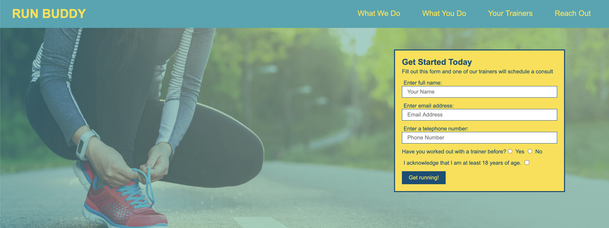

# Run Buddy

## Description 
A website that offers fitness training services built with HTML and CSS.

## Table of Contents
* [Installation](#installation)
* [Usage](#usage)
* [License](#license)
* [Contributing](#contributing)
* [Tests](#tests)
* [Questions](#questions)

## Installation 
No installation required. 

## Usage 
This applications purpose is to demonstrate skills in HTML5 and CSS3. Links are functionality to take user to others parts of the page. 
Please view deployed Git Hub [URL](https://nicolewallace09.github.io/run-buddy/)

## License 
This project is license under MIT

## Contributing 
Contributors should read the installation section. 

## Tests
There are no tests for this application. 

## Questions
If you have any questions about this projects, please contact me directly at nicole.elisaw@gmail.com. You can view more of my projects at https://github.com/nicolewallace09.
